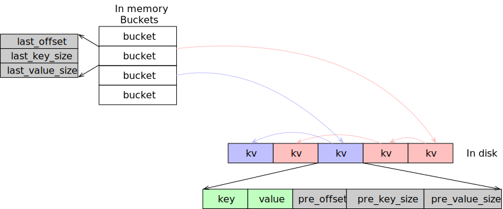

# Tiny KV

## 1. 题目描述

某个机器的配置为：CPU 8 cores，MEM 4G，HDD 4T。

这个机器上有一个 1T 的无序数据文件，格式为 `key_size, key, value_size, value`，所有 key 都不相同。

- key 的长度范围是 [1B, 1KB]。
- value 的长度范围是 [1B, 1MB]。

设计一个索引结构，使得并发随机地读取每一个 key-value 的代价最小；读取时 key 必然在文件中且大致符合齐夫分布。

允许对数据文件做任意预处理，但是预处理的时间计入到整个读取过程的代价里。

## 2. 分析

随着 key/value 长度的变化，1T 数据文件包含的 key-value 数量级会有所差别：

- 最差情况：key 都是 1B、value 都是 1B，则会有 `1TB / (1 + 1 + 16)B = 48G` 个 key-value。
- 最好情况：key 是 1KB、value 是 1MB，则会有 `1TB / (1KB + 1MB + 16B) = 1M` 个 key-value。
- 平均情况：会有 `1TB / (0.5KB + 0.5MB + 16B) = 2M` 个 key-value。

## 3. 方案设计

方案共有两种：

- 硬盘中的 HashMap
- Sorted Table

**由于时间的关系、不知道具体的查询次数，暂时只实现了第一种 硬盘中的 HashMap**。

### 3.1 硬盘中的 HashMap

内存存储 HashMap 的 Bucket 部分，硬盘存储 key-value 以及 HashMap 的链表信息。

查询时将 key-value 缓存在 LRUCache 中。

#### a. 索引结构

索引结构分为两部分：

1. 第一部分是 64M 个 Bucket，存储在内存中。每个 key-value 根据 `Hash(key)` 映射到一个 Bucket 中。由于可能存在哈希碰撞，一个 Bucket 可能存在多个 key-value。在 Bucket 中存储：桶中最后一个 key-value 在硬盘中的 offset(uint64_t)、key_size(uint64_t)、value_size(uint64_t)。
2. 第二部分是每个 key-value 的信息，存储在硬盘中。每个 key-value 存储：key、value、桶中前一个 key-value 在硬盘中的 offset/key_size/value_size。

示意图如下所示



#### b. LRUCache

使用 `unordered_map` 以及链表实现 LRUCache，在 `Get()`、`Put()` 中需要加锁。

构建一个 ShardedLRUCache，根据 key 分为 16 个 LRUCache。以此来降低锁的竞争。

最终使用 2GB 的 LRUCache，在 LRUCache 使用的内存超过 2GB 时，进行 LRU 淘汰。

#### c. Hash 算法

ShardedLRUCache 以及索引结构都使用 murmur hash 算法。

#### d. 建立索引流程

依次从 raw_input 文件中读取每个 key-value，对于每一个 key-value：

1. 根据 `Hash(key)` 映射到一个 Bucket 中，Bucket 中存储的就是同一个桶的前一个 key-value 的 offset、key_size、value_size。
2. 将 key、value、pre_offset(8B)、pre_key_size(8B)、pre_value_size(8B) 写入到 index_input 文件中。
3. 更新 Bucket 的信息为这个 key-value 在 index_input 中的 offset、key_size、value_size。

#### e. 查询流程

1. 先到 LRUCache 中查询是否存在这个 key，如果存在直接返回。
2. 否则，根据 `Hash(key)` 找到对应的 Bucket。到硬盘中去查找这个 Bucket 对应的链表的每个 key-value。
3. 找到 key-value 后，更新 LRUCache。

#### f. 优缺点

优点

- 构建索引只需要读/写一次原始数据文件，预处理代价较小。
- 由于共有 64M 个 Bucket，在 key-value 数目不大于 64M 时，每个 Bucket 几乎没有碰撞，最差只要一次 I/O 即可读取出 key-value。

缺点

- 在 key-value 数目特别多时，每个 Bucket 的链表会很长，这样一次查询需要的 I/O 次数会增多。

### 3.2 Sorted Table

先对 1TB 原始数据根据 key 进行外排序，最终得到 16384 个 64MB 排好序的文件 sst。

每个 sst 使用 Index Block 存储索引信息（每隔  4KB 数据存储一个 key-value 的 offset 和 size）。

#### a. 构建索引流程

1. 每次从原始数据读取 1GB 数据后，根据 key 进行排序。这样最终得到 1024 个排好序的文件。

2. 在内存中缓存 1024 每个文件的前 1MB 数据，使用归并排序的方式，每次选取最小的 key-value 写入 sst 文件。
3. 在一个 sst 文件写满 64MB 后，在 sst 文件尾部写入 Index Block。
4. 在内存中记录每个 sst 的 min_key、Offset of Index Block。

#### b. LRUCache

使用 LRUCache 缓存 1GB 的 Index Block、1GB 的 Data Block。

#### c. 查询流程

1. 根据 key，通过二分，找到 key 所在的 sst 文件。
2. 从 LRUCache 或 sst 文件获得 Index Block。
3. 在 Index Block 中通过二分找到对应的 Data Block。
4. 从 LRUCache 或 sst 文件获得对应的 Data Block。
5. 在 Data Block 中通过二分找到对应的 key-value。

#### d. 优缺点

优点：

- 无论 key-value 的数量和长度是多少，都可以最差情况下 2 次 I/O 获得 key-value。

缺点：

- 将 1TB 数据外排序时间代价比较大，同时读取 1024 个文件的性能与随机 I/O 类似了。由于预处理时间也计算在查询时间内，需要根据查询的次数来考虑方案的选择。如果查询的次数特别多，可以使用该方案。否则，在查询次数不是特别多、或者 key-value 数目没有超过 64M 时，可以选用硬盘 HashMap 的方案。

## 4. 运行


```shell
# 下载项目
git clone --recurse-submodules git@github.com:ZiheLiu/tinykv.git

# 安装 googletest
cd googletest
mkdir build
cd build
cmake ..
make
sudo make install

# 编译项目
cd ..
mkdir build
cd build
cmake ..
make

# 运行测试
./tinykv_test

# 生成数据
./gen_data

# 运行查询测试
./query_data
```

## 5. 测试结果

### 5.1 测试环境

硬盘

- 转速：7200 rpm。
- 扇区大小： 512 bytes logical, 4096 bytes physical。
- 顺序写 4KB：bw=11458KB/s, iops=2864
- 顺序读 4KB：bw=40669KB/s, iops=10167
- 随机读 4KB：bw=58591KB/s, iops=14647

### 5.2 测试数据

方案中，1TB 原始数据，LRUCache 占用 2GB 内存、Hash Bucket 是占用 1.5GB 内存。

实际测试时，相应缩小了 8 倍。即，128GB 原始数据，LRUCache 占用 2/8GB 内存、Hash Bucket 是占用 1.5/8GB 内存。

- key_size 是 [1B, 1KB] 的 uniform 分布、value size 是 [1B, 1MB] 的 uniform 分布，共 262255 个 key-value。

- 同时生成了 zipf 分布的测试数据，共 16332 个查询 key。查询 10 万次，频率最高的 key 占 10%。

### 5.3 测试结果

建立索引耗时：1496503.8360ms

8 个线程并发查询 key，每个线程查询 10 万次：

```
Per thread Query cost. Avg: 0.0472ms, p99: 0.0530ms, p95: 0.0500ms, p90: 0.0490ms, p80: 0.0480ms, p70: 0.0480ms, p50: 0.0470ms
Per thread Query cost. Avg: 0.0472ms, p99: 0.0560ms, p95: 0.0510ms, p90: 0.0490ms, p80: 0.0480ms, p70: 0.0480ms, p50: 0.0470ms
Per thread Query cost. Avg: 0.0484ms, p99: 0.0570ms, p95: 0.0520ms, p90: 0.0500ms, p80: 0.0490ms, p70: 0.0490ms, p50: 0.0480ms
Per thread Query cost. Avg: 0.0484ms, p99: 0.0560ms, p95: 0.0520ms, p90: 0.0510ms, p80: 0.0500ms, p70: 0.0490ms, p50: 0.0480ms
Per thread Query cost. Avg: 0.0504ms, p99: 0.0570ms, p95: 0.0550ms, p90: 0.0540ms, p80: 0.0530ms, p70: 0.0520ms, p50: 0.0510ms
Per thread Query cost. Avg: 0.0504ms, p99: 0.0570ms, p95: 0.0550ms, p90: 0.0540ms, p80: 0.0530ms, p70: 0.0520ms, p50: 0.0510ms
Per thread Query cost. Avg: 0.0528ms, p99: 0.0600ms, p95: 0.0580ms, p90: 0.0580ms, p80: 0.0570ms, p70: 0.0560ms, p50: 0.0550ms
Per thread Query cost. Avg: 0.0529ms, p99: 0.0630ms, p95: 0.0590ms, p90: 0.0580ms, p80: 0.0570ms, p70: 0.0560ms, p50: 0.0550ms
```

